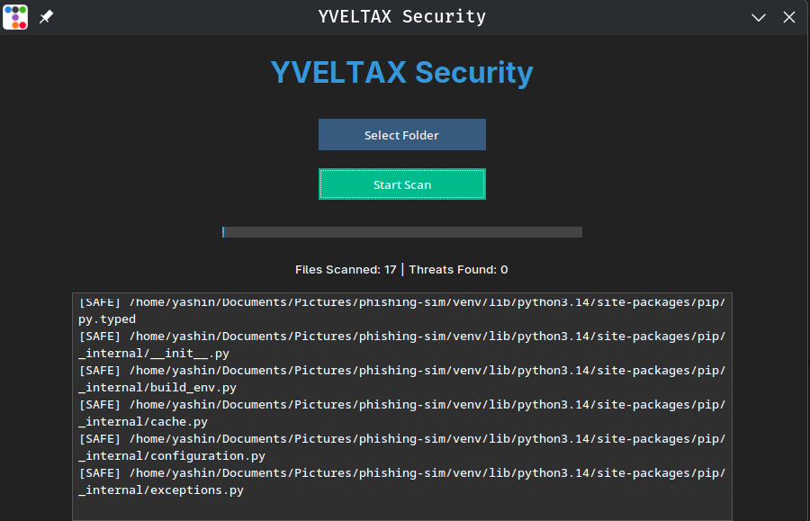

# Yveltax Antivirus

Yveltax Antivirus is a lightweight Python-based antivirus application built for educational and cybersecurity learning purposes. The project features a modern GUI, multithreaded file scanning, SHA256 signature-based malware detection, VirusTotal integration, and a quarantine management system.

---

## Features

- Recursive folder scanning
- SHA256 hash-based malware detection
- Suspicious extension analysis
- VirusTotal API integration
- Multithreaded scanning engine
- Quarantine management system
- Real-time scan statistics
- Modern dark-themed GUI using ttkbootstrap
- Modular project architecture

---

## Technologies Used

- Python
- Tkinter
- ttkbootstrap
- hashlib
- threading
- requests
- python-dotenv
- PyInstaller

---

## Project Structure

```text
Yveltax/
│
├── main.py
├── gui.py
├── scanner.py
├── quarantine_manager.py
├── virustotal.py
├── requirements.txt
├── README.md
├── .gitignore
│
├── assets/
├── signatures/
│   └── hashes.txt
│
├── quarantine/
└── screenshots/
```

---

## Installation

### Clone or Download the Project

```bash
cd yveltax---av
```

---

## Create Virtual Environment

### Linux/macOS

```bash
python3 -m venv venv
source venv/bin/activate
```

### Windows

```bash
python -m venv venv
venv\Scripts\activate
```

---

## Install Dependencies

```bash
pip install -r requirements.txt
```

---

## VirusTotal API Setup

Create a `.env` file in the project root:

```env
VT_API_KEY=your_api_key_here
```

Get your free API key from:

https://www.virustotal.com/

---

## Run the Application

```bash
python main.py
```

---

## Packaging (Linux)

```bash
pyinstaller \
--onefile \
--windowed \
--name Yveltax \
--collect-all ttkbootstrap \
--collect-all PIL \
--add-data "signatures:signatures" \
main.py
```

---

## Screenshots





---

## Disclaimer

Yveltax Antivirus is an educational cybersecurity project and should not be considered a replacement for professional antivirus solutions.

This project is intended strictly for:
- cybersecurity learning
- malware analysis education
- software development practice
- authorized security research

Do not use this project for unauthorized or malicious activities.

---

## Future Improvements

- Real-time protection
- Process monitoring
- Scan scheduling
- Threat severity levels
- Dashboard analytics
- Automatic signature updates
- Linux desktop integration
- AppImage packaging

---

## Author

Pelagornisandersi
